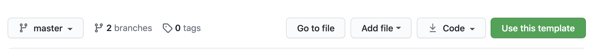

# Advanced Router

## Topics
- [Get Started](#get-started)
- [Starting the Project](#starting-the-project)
___

## Get Started
### Use Template
#### 1. To get started, click the GREEN "Use this Template" button at the top of the repo

#### 2. Make sure YOUR github account is selected in the dropdown and name your project

3. Clone your new repo to your local machine
4. Go to the **NEXT** section

## Starting the Project
1. From your command line, be in the root directory and run `npm install` OR `npm i` for short
1. From your command line, be in the root directory and run `npx husky install`
1. To start your application, run `npm start`
